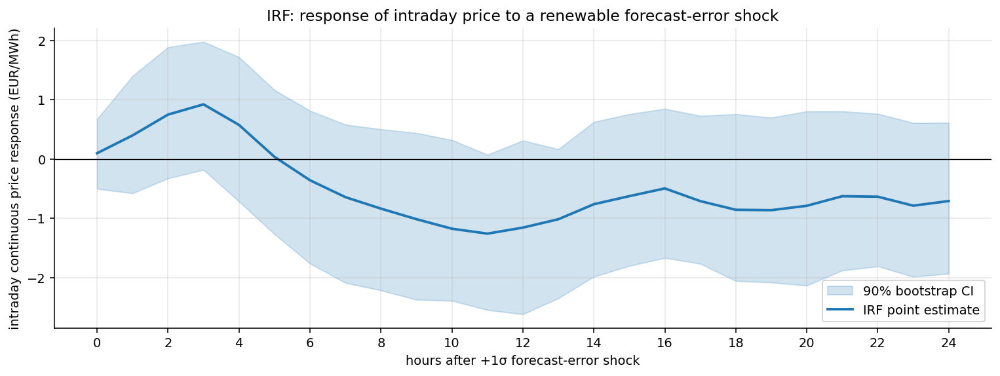
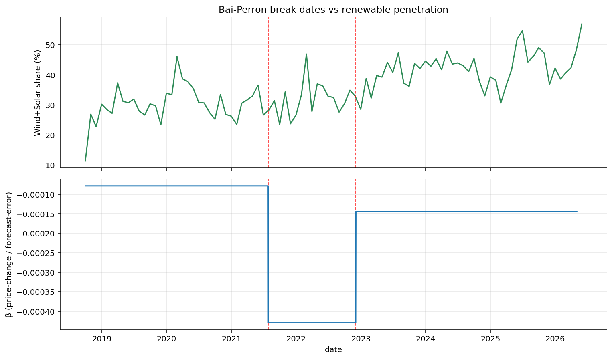
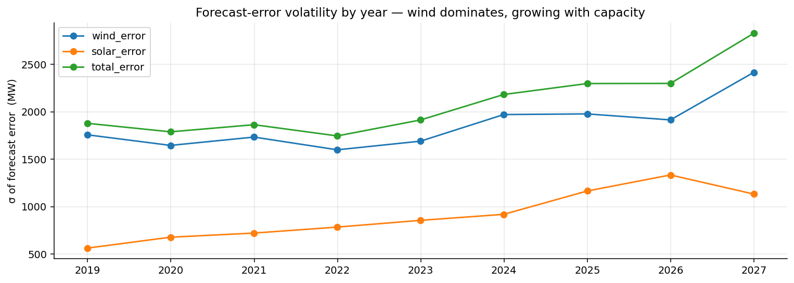
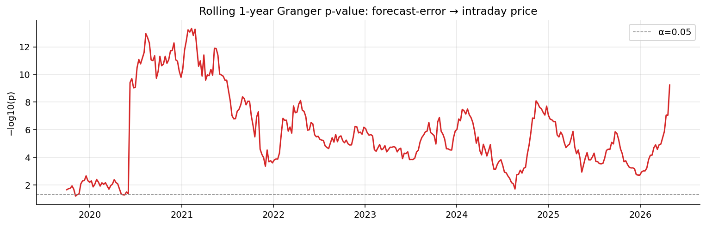
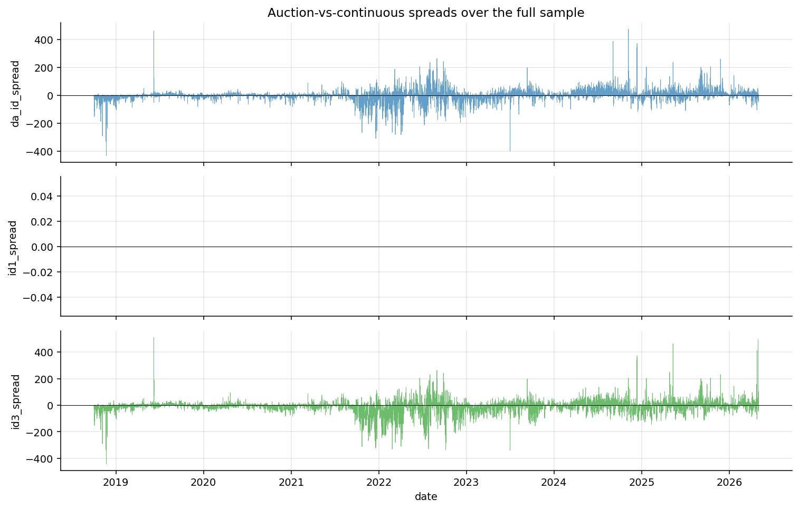
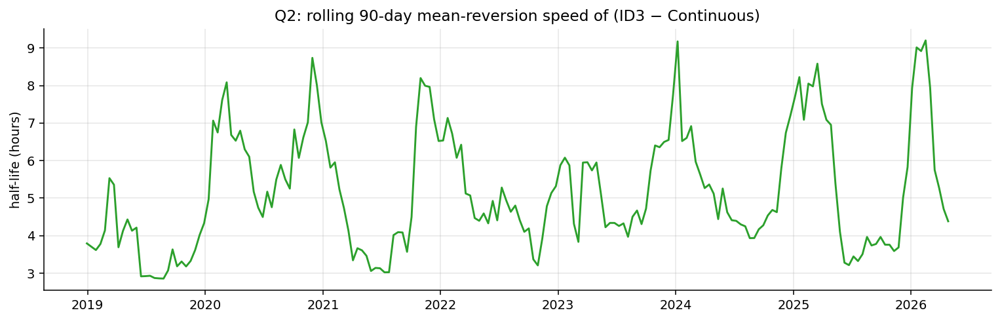
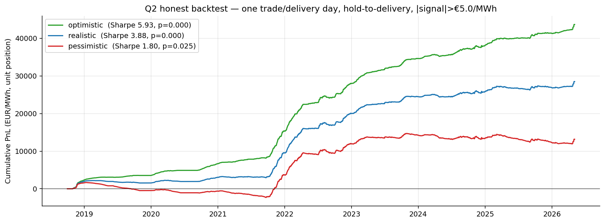

# Findings

The longer version of what's in the README. Three questions, the data behind them, the methods and the bits that ran the wrong way against my prior.

## Contents

- [Why this market](#why-this-market)
- [Data](#data)
- [Q1. Forecast errors and intraday price impact](#q1-forecast-errors-and-intraday-price-impact)
- [Q2. Auction vs continuous and the backtest](#q2-auction-vs-continuous-and-the-backtest)
- [Q3. Shape spread and battery dispatch](#q3-shape-spread-and-battery-dispatch)
- [What you'd actually do with this](#what-youd-actually-do-with-this)
- [Where this falls over](#where-this-falls-over)
- [If I come back to this](#if-i-come-back-to-this)

## Why this market

EPEX intraday is interesting because the same delivery hour clears in three sequential venues: day-ahead auction, then intraday auctions (ID3 at 22:00 day-1, plus the post-2024 IDA series), then a continuous market that runs until five minutes before delivery. Renewables come in different from forecast and that imbalance has to clear in those venues, in that order. So you get the same physical signal showing up in three clearing prices, separated by time. That's what makes the spread questions worth asking.

## Data

Two free public sources.

| Source | Series | Why |
|---|---|---|
| ENTSO-E | DA wind & solar generation forecast (per technology, hourly) | The forecast the DA market clears against. Subtract from actuals to get imbalance volume. |
| ENTSO-E | Actual generation per type (hourly) | The realised side of the forecast error. |
| ENTSO-E | DA clearing prices | Price anchor. |
| ENTSO-E | Actual load (15-min) | Confounder. Load FE drives intraday too; useful as a regime variable. |
| SMARD | ID3 auction clearing price (hourly) | Settles at one price per delivery hour. Cleanest auction-side observable. |
| SMARD | Intraday continuous index, hourly | Volume-weighted average of all continuous trades for each delivery hour. |
| SMARD | Intraday continuous index, 15-min QH | For the shape spread. |

Window is 2018-10-01 to 2026-05-04. About 66 500 hourly observations. October 2018 is when the German bidding zone became `DE_LU` on its own; before that it was `DE_AT_LU`, which is a different population.

One limit to flag up front: there's no order-book data. EPEX continuous trade-by-trade is sold as a paid subscription and I don't have it, so the continuous "price" I work with is the published volume-weighted index, which is a settlement statistic rather than an order book. That caps how far I can push proper microstructure. Side note: the auction side runs on ID3 and DA, both with full coverage across the window. The legacy ID1 series isn't in the SMARD export I'm pulling, but the cointegration question Q2 asks is answered by the two auctions I do have.

## Q1. Forecast errors and intraday price impact

When wind comes in higher or lower than the DA forecast, somebody has to trade the gap intraday. That's signed flow. The hypothesis was that the price moves in response and that the link should grow stronger as Germany's renewable share grew.

The chain of tests.

Stationarity first. Both ADF (null = unit root) and KPSS (null = stationary) jointly, because the two have opposite nulls and a series has to convince both before I treat it as stationary. Then Granger causality on the level series with AIC-selected lag up to 24 hours, in both directions. Forward asks whether forecast error helps predict price; reverse is the sanity check, because if both sides reject on a long sample like this it usually means common drivers are confounding rather than reverse causality. Then the IRF, which traces the *shape and magnitude* of the price response over time after a 1σ shock to forecast error (Cholesky orthogonalisation, residual bootstrap for the 90% bands). Then the FEVD, which tells you what fraction of intraday-price variance is structurally attributable to forecast-error innovations vs the price's own past, which is the substantive complement to the IRF. Finally Bai-Perron sequential structural-break detection on the daily β coefficient, which finds *unknown* dates where a regression coefficient jumps.

Forward Granger rejects very strongly: F = 11.05, p ≈ 2×10⁻⁴² at AIC-selected lag 24h, n = 66 526. Reverse is also significant (F = 8.31, p ≈ 1.5×10⁻²⁹). At this sample size, bidirectional rejection is what you'd expect when both series share common drivers like load forecast errors and weather regimes, not evidence of reverse causality. So Granger is necessary but not sufficient.

The IRF:



Point estimate has the right shape: small positive bump at hours 1 to 3 (probably a Cholesky artefact from ordering forecast-error first), clear negative trough around hour 11 at about −1.3 EUR/MWh, slow decay back to about −0.7 by hour 24. Negative trough is the hypothesised direction (more renewables than forecast → bearish price). But the 90% bootstrap CI doesn't actually exclude zero at any horizon. Hour 11's upper bound is +0.07, the closest call. The IRF supports the direction, but on this sample I wouldn't claim significance from the IRF on its own.

The FEVD attributes under 5% of intraday-price variance to forecast-error innovations at every horizon up to 24h. The price's own autoregressive memory takes the rest. So the relationship exists but is small relative to the price's own dynamics.

Bai-Perron is where the original hypothesis broke. I expected β to drift up over time as renewables grew. Instead the test finds two clean breaks:



| Date | supF p | β jump | Where this lands |
|---|---:|---|---|
| 2021-07-27 | 3.7×10⁻³ | β goes from −7.9×10⁻⁵ to −4.3×10⁻⁴ (5.5× bigger) | TTF gas going vertical (€25 → €100 by October) |
| 2022-12-03 | 1.5×10⁻⁵ | β returns to −1.4×10⁻⁴ (~1.8× the pre-crisis level) | Gas back to ~€120 from August's €330 peak |

Those are gas-crisis bookends, not renewable-capacity events. Renewable share grew steadily across the sample with no step changes; gas had two clear regime shifts at exactly the dates the test picks out. The story isn't "renewables grew so β grew", it's "the price impact of an MWh of imbalance scales with the cost of the gas plant covering it". A 2 GW wind shortfall costs about 10× more €/MWh in 2022 than in 2020 because the marginal generator is 10× more expensive. That makes physical sense once you see it. It also has a real model-risk implication: a static β fitted on 2018-2021 will be silently wrong in 2022 unless you condition on gas.

Forecast-error volatility itself does grow steadily with the fleet:



So imbalance *volume* grows with renewable capacity, but the €/MWh price of an imbalance moves with the merit-order regime. Two effects, two trends, both real, often confused.

Rolling 1-year Granger −log₁₀(p) confirms the relationship has been persistently significant since mid-2020, with a peak in late 2020 / early 2021:



## Q2. Auction vs continuous and the backtest

Same delivery hour, two venues. ID3 at 22:00 day-1 (auction, single-clearing). Continuous trading running until five minutes before delivery. The starting intuition was that the auction is the price-discovery venue and continuous should track it. Data say the opposite.

The cointegration chain runs ADF + KPSS jointly per series (so both have to look unit-root in levels for a cointegration story to make sense), then Engle-Granger as a cheap first pass, then Johansen as the proper rank test for the bivariate system, then a VECM. The VECM is the interesting one: once two series cointegrate, the α coefficients tell you the *speed of adjustment* on each side. When the spread widens, how fast does each series move back? If one α is much bigger in magnitude than the other, that side does more of the corrective work. Half-life via closed-form AR(1) on the spread (`ΔS_t = γ S_{t-1} + ε`, half-life = −ln(2)/ln(1+γ)) on the full hourly sample.

Both DA-vs-continuous and ID3-vs-continuous cointegrate cleanly:



| | DA vs Cont | ID3 vs Cont |
|---|---:|---:|
| Engle-Granger t | −7.07 | −5.12 |
| Engle-Granger p | 6×10⁻⁹ | 1×10⁻⁴ |
| Johansen rank | 2 | 2 |
| Spread half-life | **3.5 h** | **5.5 h** |
| α (auction) | −0.96 | −0.71 |
| α (continuous) | −0.55 | −0.26 |
| Auction does X× more of the work | 1.7× | **2.7×** |

When the spread widens, the auction moves more than the continuous market does. The continuous market is the price anchor; the auction is the price taker. Practical version: if the auction prints far above where continuous has been trading, expect the next auction to come back, not the continuous to chase.

The Johansen cointegrating vectors are also worth a look. They're [1, −0.79] for DA-vs-cont and [1, −0.69] for ID3-vs-cont, not unit-1. So in long-run equilibrium DA prices clear at about 79% of continuous, ID3 at about 69%. The auction is systematically lower than the continuous price for the same delivery hour, more so for ID3, which fits the institutional setup: ID3 clears at 22:00 day-1 and the continuous market keeps discovering price right up to delivery, so the auction price embeds an uncertainty discount.

Spread variance widens with the renewable forecast-error regime in both pairs:

| Forecast-error regime | DA σ (€/MWh) | ID3 σ (€/MWh) |
|---|---:|---:|
| Low \|fe\| | 23.0 | 31.0 |
| Med \|fe\| | 24.1 | 32.9 |
| High \|fe\| | 27.9 | 36.8 |

Variance ratios are 1.21× (DA) and 1.19× (ID3) across the high vs low regime tercile. Modest, but the directional sign is right and the ordering is monotone, which is the structural prediction.

Mean-reversion speed itself is stable across the sample, with seasonal modulation (winter peaks, summer troughs). No secular trend:



### The backtest

The cointegration result above works on `ID3 - continuous_VWAP` as a single time series, but a real position can't be put on that way. ID3 settles at one fixed price at 22:00 day-1. The continuous_VWAP for that delivery hour is a settlement statistic that doesn't exist until after delivery, because it's the volume-weighted average of all the continuous trades that happened during the trading window. So at decision time you see one leg, never both. There's also no exit. Auctions clear at one price, continuous fills happen across the trading window, settlement is what it is and you take whatever spread comes out.

That collapses the strategy to one decision per delivery day, hold to physical delivery, signal computed from things that exist *before* the auction clears. The pre-registered spec, committed before running anything:

```
At the 22:00 day-1 auction commitment, compute the trailing 90-day mean of
(ID3 − continuous_VWAP) per delivery hour. Pick the hour with the strongest
|signal|. If |signal| > €5/MWh, take direction = sign(signal). Hold to
physical delivery. One trade per delivery day.
Costs apply only to the continuous leg.
```

Translation: the spread has had a positive bias for this hour over the last 90 days, take the corresponding direction. Crude, but the trailing window only uses already-settled spreads from earlier delivery days, so there's nothing to peek at.

Walk-forward across the full sample, three cost scenarios, stationary block bootstrap for the Sharpe p-value (block length √T preserves the autocorrelation of the daily PnL series; iid bootstrap on autocorrelated PnL would over-state significance).



| Scenario | Sharpe | Bootstrap p | When the PnL came in |
|---|---:|---:|---|
| Optimistic (fees only) | 5.93 | < 0.001 | 75% from 2021 to 2022 |
| Realistic (€6/MWh round-trip) | **3.88** | < 0.001 | 75% from 2021 to 2022 |
| Pessimistic (€12/MWh) | 1.80 | 0.025 | 75% from 2021 to 2022 |

Numbers look strong, but the regime concentration is the bigger story. Year by year under pessimistic costs:

```
2018Q4   +1 559    2022    +8 291    ← gas-crisis peak
2019     −2 041    2023    +2 289
2020       −128    2024      −813    ← edge has compressed
2021     +4 272    2025    −1 115
                   2026Q1   +837
```

The strategy lost money in 4 of 9 calendar years under pessimistic execution and earned three-quarters of its lifetime PnL during the 2021-2022 gas crisis. Same regime story as Q1's Bai-Perron breaks, viewed from the trading side. This is a regime harvester, not a permanent alpha. The spread's tradeable mean-reversion magnitude tracks gas, not anything structural.

## Q3. Shape spread and battery dispatch

The hourly block and the four 15-minute QH products are different ways to buy the same delivery hour. Shape spread is `hourly − mean(4 QH)`. Hour-of-day pattern is the chart at the top of the README and it's striking.

To pull out the mechanism while controlling for time of day, OLS with 23 hour-of-day dummies (one hour omitted as reference). The dummies absorb the duck curve itself; the σ coefficient then tells you the *within-hour* effect of intra-hour QH price σ on the shape spread. That separates "shape spread varies with hour" (obvious from the chart) from "shape spread varies with realised intra-hour volatility" (the actual mechanism).

```
shape_spread ~ const + intra_hour_σ + 23 hour FE
n = 56 569       R² = 0.054
intra_hour_σ coefficient: −0.91 (t = −30.8)
```

For every additional €1/MWh of realised intra-hour QH price σ, the shape spread drops by €0.91/MWh. The QH bundle becomes richer than the hourly block when the intra-hour ramp is sharper. Right sign, big t-stat, R² is small because the hour-of-day FE absorbs the deterministic part and σ explains a small but real fraction of what's left.

Conditioning on the forecast-error regime instead of intra-hour σ tells the same story:

| Forecast-error regime | shape σ (€/MWh) | shape mean (€/MWh) |
|---|---:|---:|
| Low \|fe\| | 21.1 | +4.9 |
| Med \|fe\| | 21.9 | +4.8 |
| High \|fe\| | 24.6 | +2.0 |

Under high uncertainty, σ widens (24.6 vs 21.1) and the mean drifts toward zero — the duck-curve hour-of-day pattern that drives the unconditional mean is partially washed out by noise when forecasts are far off. Both effects are consistent with shape spread being priced as an intra-hour-uncertainty premium.

### Battery dispatch sim

If the shape spread is real, the natural application is a battery operator. The simulator runs at typical 2025-26 grid-scale specs in Germany: 100 MW power, 200 MWh capacity (2-hour duration), 85% round-trip efficiency, €2/MWh wear, 1.5 cycles/day for warranty.

The optimiser is a daily linear program over 24 hours. Variables `c_t` charge, `d_t` discharge, `s_t` state-of-charge per hour, 72 variables total per day. Objective `Σ p_t·d_t − p_t·c_t − wear·d_t`. Constraints: SoC dynamics with separate charge/discharge efficiencies, power and energy bounds, daily cycle cap. `scipy.optimize.linprog` with HiGHS solves each day in milliseconds; the full sample (~2 700 days × 4 strategies) finishes in a few minutes.

Four strategies share the same solver, differing only in which price vector they optimise against:

| Strategy | Annual revenue | €/MW/year | Uplift vs naive |
|---|---:|---:|---:|
| Naive (cheapest 2h charge / richest 2h discharge per day, no LP) | €3.92 M | €39 k | baseline |
| DA-LP (LP optimised against day-ahead prices) | €4.71 M | €47 k | **+20%** |
| DA + Q1 forecast-error tilt | €4.70 M | €47 k | +20% (~unchanged) |
| Perfect foresight (LP against realised intraday, the ceiling) | €5.52 M | €55 k | +41% |

The €47 k/MW/year for DA-LP lands inside the €40 to €60 k/MW/year industry range for German BESS arbitrage, so the LP isn't obviously broken. The Q1 intraday tilt added basically nothing on top of DA-LP, which I expected to be the headline of the BESS section and instead ended up as a footnote. The mechanical reason is that DA prices already incorporate the renewable forecast: the DA market is, against expectation, doing its job. The residual signal in the forecast error doesn't move the schedule much when prices are already near-optimally arranged across the 24 hours.

This is energy arbitrage only. Real grid-scale operators stack another 30 to 50% from primary control reserve (FCR/aFRR), which the simulator doesn't model. The €4.7 M/year is a floor, not a forecast.

## What you'd actually do with this

Of the three questions, only Q2 maps cleanly to a real-world trade. The auction-vs-continuous spread is a real economic spread between two sequential clearing mechanisms for the same delivery hour. A balance-responsible party can commit at the auction, settle at intraday and the PnL is what it is. Q1's price-impact channel exists but is too small and too regime-conditional to clear typical execution costs as a standalone signal. Q3's shape spread is real but executing it as a financial trade requires five legs per cycle (1 hourly + 4 QH × 2 sides), which is rough without natively-hedged shape products.

If you wanted to actually run the Q2 strategy, the deployable framing isn't "always-on stat-arb": it's σ-conditioned. Operate when the 90-day rolling σ of the spread is wide enough to clear execution costs and stand down when it's compressed. The pessimistic-cost line in the cumulative-PnL chart is essentially flat from late 2023 onward; that's what running it ungated would give you in current conditions.

For a battery operator, the BESS sim is the directly useful output. DA-LP captures €47 k/MW/year of arbitrage revenue, consistent with industry benchmarks. Q1 forecast-error tilt adds basically nothing on top because DA prices already absorb the renewable forecast. Q2 venue-selection is a small refinement. The bulk of arbitrage alpha sits in solving the DA dispatch LP correctly. The microstructure findings are supporting cast, not the headline.

For risk and model validation, Q1's Bai-Perron result is the most useful piece. A model using a single static β for renewable price impact will be wrong in regimes where the marginal generator cost diverges from the historical mean. The 2022 energy crisis is the worked example, but the underlying point is that the reduced-form β is structurally unstable across gas-price regimes.

## Where this falls over

Things that affect the headline numbers:

1. Bidirectional Granger at this sample size implies confounding. Common drivers (load forecast errors, weather regimes) bleed into both series. Standard fix is adding load FE as exogenous in the VAR; not done.
2. Cointegration tests run on a 3-year subsample, not the full hourly history. ADF + Johansen + VECM at T = 66 528 hourly hung when I tried it (ADF autolag selection in particular is expensive at that size). Half-life is on the full sample via closed-form AR(1); the formal test stats are a recent-period snapshot.
3. The Q1 IRF bootstrap CI doesn't exclude zero at any horizon. Granger F-test rejects strongly because of pooled information across 24 lags; the IRF magnitude on its own isn't significant. The structural pieces (FEVD, Bai-Perron) carry the substantive findings.
4. Cholesky ordering in the IRF is a choice, not an identification. Forecast-error first because the hypothesis demanded it. A sign-restriction SVAR or instrument-based identification would make this defensible.

Things that affect the Q2 backtest:

5. Strategy is regime-conditional. Pessimistic-cost Sharpe is 1.80 over 9 years with bootstrap p = 0.025, but the strategy lost money in 4 of 9 calendar years and earned 75% of lifetime PnL during 2021-2022. Don't read the headline as a steady-state alpha.
6. Execution risk on the continuous leg isn't fully modelled. I apply a flat round-trip cost; reality has nonlinear cost curves (slippage rises with σ, which is exactly when the trade is most attractive). The pessimistic scenario at €12/MWh is closer to honest but still simplistic.

Things that affect the BESS sim:

7. Energy arbitrage only. No FCR/aFRR revenue stack, which is 30 to 50% of real grid-scale BESS revenue. The €4.7 M/year is a floor.
8. No bid-ask cost on the BESS dispatch. The LP transacts at published prices. Same execution-noise issue as Q2.

Things that affect generalisability:

9. Single bidding zone (DE_LU). Cross-zone replication would test whether the findings are Germany-specific.

Each of these is a known gap. They don't undermine the qualitative findings, but they do bound the strength of any quantitative claim.

## If I come back to this

Roughly in priority order:

* Add load forecast error as exogenous in the VAR (closes the bidirectional-Granger objection)
* Restructure cointegration tests to run on the full hourly sample
* Sensitivity grid on Q2 backtest entry threshold and training window
* Pull the IDA1/IDA2/IDA3 SMARD codes to add a third auction venue alongside DA and ID3
* Add FCR/aFRR revenue to the BESS sim
* Cross-bidding-zone replication (DE_LU vs DK1, DK2, FR, NL)
* Threshold VECM for asymmetric mean-reversion in Q2
* Instrumented price-impact regression using lagged weather forecast revisions
