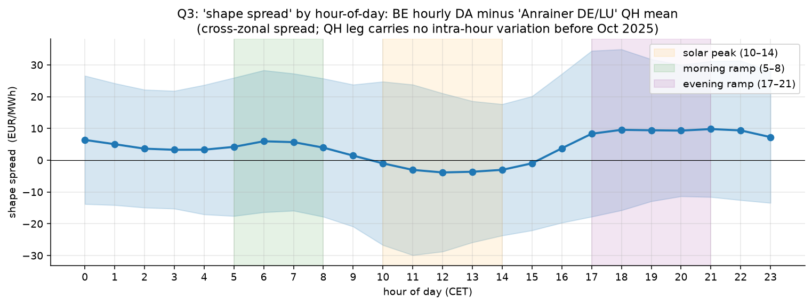

# 🦆⚡ German Intraday Power: Microstructure & Spread Dynamics

An applied-econometrics look at the German EPEX intraday electricity market, run on 7.6 years of free public data. Three structural questions, one tradeable spread that holds up and several findings that ran the wrong way against the original hypotheses (which I kept).

The duck curve — solar overproduction collapsing midday prices while evening demand sends them back up — shows up not just in day-ahead markets but as a persistent, priceable spread between hourly and 15-minute quarter-hour products in the intraday market. That's the thread connecting all three questions.

[](https://www.python.org/downloads/)
[](#tests)
[](LICENSE)



That's the headline result. The shape spread (price difference between buying one hourly block and four 15-minute QH blocks for the same delivery hour) swings from +€10/MWh at evening ramp to −€4/MWh at solar peak, every day, for seven and a half years. It's the duck curve as a tradeable spread, recovered cleanly from public data.

## Findings, short version

| Q | Hypothesis | Result |
|---|---|---|
| Q1 | Renewable forecast errors should drive intraday prices and the relationship should grow as renewables grow. | The relationship exists but is small (FEVD <5%, IRF CI doesn't exclude zero). The structural-break test puts the *step changes* in the price-impact coefficient on the European energy-crisis bookends, not on renewable-capacity events. β tracks gas, not capacity. |
| Q2 | Auction and continuous prices for the same delivery hour should cointegrate; auction is the price-discovery venue. | Cointegration is unambiguous, half-life 3.5 to 5.5 hours, but VECM α directionality says the auction is the price *taker*, not the discovery venue. Pre-registered walk-forward backtest is bootstrap-significant across all three cost scenarios, but 75% of lifetime PnL came from the 2021-2022 gas crisis and the edge has compressed since 2023. Regime harvester, not a permanent alpha. Numbers in [FINDINGS.md](FINDINGS.md#q2-auction-vs-continuous-and-the-backtest). |
| Q3 | Hourly vs four 15-min QH should price intra-hour ramp risk. | Strong duck-curve fingerprint. Within-hour σ has coefficient −0.91 (t = −31). BESS dispatch sim at typical 100 MW / 200 MWh utility specs gives €4.7 M/year arbitrage revenue against a €5.5 M/year ceiling. |

Of the three, only Q2 maps cleanly to a real-world trade. Deep version of all this is in [FINDINGS.md](FINDINGS.md).

## Running it

```bash
# 1. clone + install
git clone https://github.com/timo/power-microstructure.git
cd power-microstructure
python -m venv .venv && source .venv/bin/activate
pip install -e ".[dev]"

# 2. set your free ENTSO-E API key (the platform takes 1 to 3 working days)
export ENTSOE_API_KEY="your-key-here"

# 3. fetch data (~45 min first time, instant after; parquet cached)
python scripts/fetch_full_history.py

# 4. run the three econometric analyses (~5 min)
python scripts/run_full_analysis.py

# 5. run the Q2 walk-forward backtest (~10 s)
python scripts/run_q2_honest_backtest.py

# 6. run the BESS dispatch simulation (~3 min, ~2 700 LPs)
python scripts/run_q3_battery.py

# 7. open the rendered notebooks
jupyter lab notebooks/
```

Every figure in this repo and every number in the conclusions can be regenerated with these commands. SMARD doesn't need a key; ENTSO-E does.

## What's where

The package is layered. Each layer depends only on the one above it. Notebooks read from `results/`, never from raw data, so notebook execution stays fast.

```
power_microstructure/
├── data/                I/O layer: raw market data → tidy DataFrames
│   ├── entsoe.py        ENTSO-E API wrapper (forecasts, generation, DA, load)
│   └── smard.py         SMARD wrapper (DA / auction / continuous index / QH)
├── signals/             Feature layer: tidy DataFrames → research signals
│   ├── forecast_error.py    Q1: forecast errors and derivatives
│   └── spread.py            Q2/Q3: auction-vs-cont and shape spreads
├── analysis/            Inference layer: signals → econometric tests
│   ├── granger.py           VAR / Granger / IRF / FEVD / rolling Granger
│   ├── cointegration.py     ADF + KPSS / Engle-Granger / Johansen / VECM
│   └── structural.py        Bai-Perron with custom prefix-sum DP
└── strategy/            Application layer: signals → PnL
    ├── backtest.py          Walk-forward, transaction costs, bootstrap p-value
    └── battery.py           BESS dispatch LP optimiser

scripts/                 Thin runners (fetch, analyse, backtest, BESS, render)
tests/                   56 passing tests on synthetic data, no API keys needed
notebooks/               Three result-driven EDA notebooks per question
results/                 Output: figures, tables, summary.json, CONCLUSIONS.md
```

A few specifics worth pointing at:

* Every API call is sha-keyed on its parameters and stored as parquet under `~/.cache/power_microstructure/`. First fetch takes ~45 minutes; subsequent runs are seconds.
* ENTSO-E returns 504s on multi-year `query_generation` calls. `EntsoeFetcher.actual_generation_per_type` chunks into 60-day blocks and recovers from gateway timeouts.
* Bai-Perron at T > ~5 000 needs more memory than a laptop has if you precompute the RSS matrix. [`structural.py`](power_microstructure/analysis/structural.py) replaces the matrix with closed-form OLS over prefix sums (O(T·m) memory, exact global optimum). Brute-force-equivalence-tested on small T; scaling-tested at T = 20 000.
* [`battery.py`](power_microstructure/strategy/battery.py) is a real linear program. 72 variables per day, SoC dynamics with separate charge/discharge efficiencies, daily cycle cap, scipy/HiGHS solver. Same engine, four price-vector inputs.

## Tests

```bash
pytest tests/
# 56 passed in 110s
```

Synthetic data with known statistical properties. No API keys, no network. Each econometric tool is checked against a series with the property it should detect (Granger on a series we constructed to be Granger-caused; cointegration on a pair we constructed to share a stochastic trend; Bai-Perron DP against brute-force enumeration).

## Other reading

[FINDINGS.md](FINDINGS.md) is the longer write-up: three questions, methods, results, the constraint that shaped the Q2 backtest, and the limitations.

## License

MIT, see [LICENSE](LICENSE).

## Where the data comes from

| Source | Auth |
|---|---|
| [ENTSO-E Transparency Platform](https://transparency.entsoe.eu/) | Free API key. Email `transparency@entsoe.eu`, subject *"Restful API access"*, body = your registered email. Token shows up at My Account Settings → Web Api Security Token after they reply, which takes 1 to 3 working days because they appear to do this by hand. |
| [SMARD (Bundesnetzagentur)](https://www.smard.de/en) | None, open HTTP. |

The ENTSO-E client is [`entsoe-py`](https://github.com/EnergieID/entsoe-py). Methodological prior art is [Florian Ziel](https://dsee.wiwi.uni-due.de/team/florian-ziel/) and the [House of Energy Markets and Finance](https://www.hemf.wiwi.uni-due.de/) at Duisburg-Essen.
